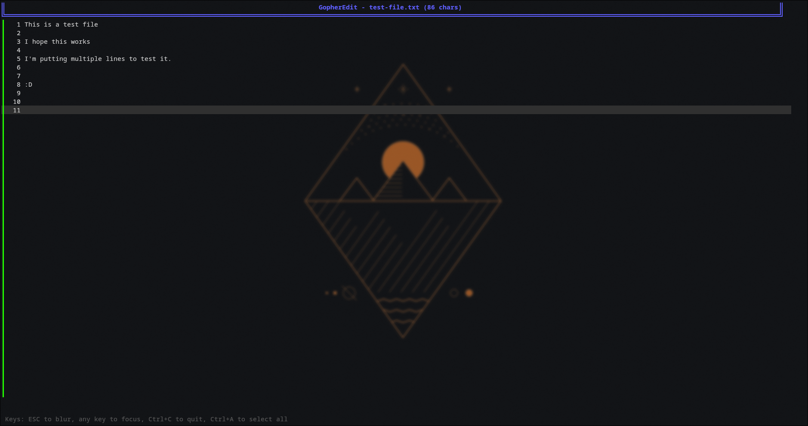
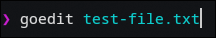

# Simple Go terminal text editor

### Uses the following packages

- [github.com/charmbracelet/bubbletea](https://github.com/charmbracelet/bubbletea)
- [github.com/charmbracelet/bubbles](https://github.com/charmbracelet/bubbles)
- [github.com/charmbracelet/lipgloss](https://github.com/charmbracelet/lipgloss)

## Not worth using right now this is just me playing with stuff

### If using

- `cd root directory`

- `Go run ./cmd/. /path/to/file`

#### Example

### If not wanting to cd in to the root directory to always edit files (Only tested on Linux)

- `cd root directory`

- `Go build ./cmd/main.go -o {output name}`

- `mv {output name} ~/.local/bin`

- `{output name} /path/to/file`

#### Example

